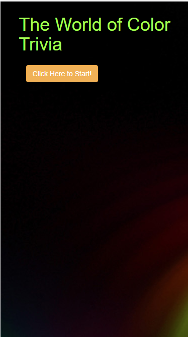
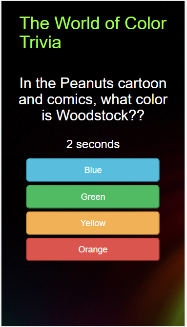

# <a href="https://writesandy.github.io/TriviaGame/">TriviaGame</a>

 

# TriviaGame

Fun Game of trivia on all things color related.

## App Design Description

One of my first apps learning how to create html, css and javascript files.

## Color Trivia incorporates:

## Screenshots

 

